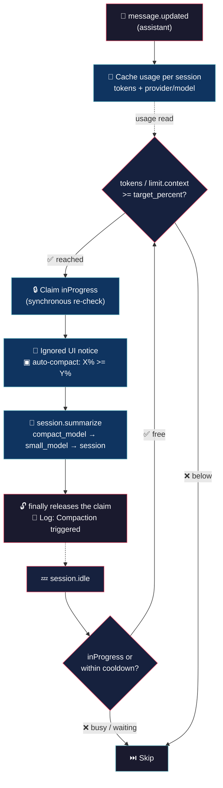

# Auto Compact (your window, your rules)


> Your context hits the ceiling. OpenCode picks the moment and your expensive working model pays for the summary? Not anymore!

## 💡 What it does

> Compaction on your terms: your %, their tokens.

- **Fixed percentage trigger** — compacts when context usage reaches `target_percent` (e.g. 50%), regardless of opencode's internal formula.

- **Model delegation** — the summary is generated by `small_model` (or an explicit `provider/model`), never by the working model. Compaction cost stops competing with your main model.

- **Native engine, custom trigger** — fires opencode's internal `session.summarize` (the same one behind `/compact`), so the summary, verbatim tail and recovery stay 100% opencode.

- **Terminal notice** — one ignored line per trigger (`▣ auto-compact: 51.2% ≥ 50% — compacting with provider/model`). UI-only: never sent to the model (`ignored` part + `noReply` prompt).

- **Safe by design** — single-claim `inProgress` guard (synchronous claim, `finally` release), per-session cooldown, model validation against the catalog, errors logged without breaking the session.

## 🧠 Philosophy

Compaction is scheduled maintenance, not an emergency. The working model is for work; summarizing is a cheap job for the cheap model.

The % is yours. Native auto decides when; here the threshold is fixed, visible and predictable.

The plugin never blocks you, never pays a summary with your main model, and never breaks a session it cannot first guard.

## 🔄 How it works



## 🎯 Use cases

**The daily driver pays less.** Every compaction pays summary tokens with the model you chose for the job. Delegate the summary to `small_model` and the bill drops to pocket change.

**No surprise compactions.** Native auto decides *when*. Here 50% means 50%, every session, every project — visible in the config, not in the engine's mood.

**Long unattended runs.** A build-and-fix loop at 2 AM fills the window. The plugin fires at the threshold and the session keeps moving — no manual `/compact` at 3 AM.

**Explicit model, validated.** Prefer a specific summarizer? Point `compact_model` at any `provider/model`; the plugin checks the catalog before using it, and falls back with a clear log when the model is unknown.

## 🚀 Installation

```bash
cp auto-compact.ts ~/.config/opencode/plugins/auto-compact.ts
cp auto-compact.jsonc ~/.config/opencode/auto-compact.jsonc
```

No npm, no build step, no dependencies. OpenCode runs TypeScript natively. Restart opencode; the plugin loads on start.

## ⚙️ Configuration

Copy `auto-compact.jsonc` (included in this repo) to `~/.config/opencode/` and edit:

```jsonc
{
	"enabled": true,                // master switch
	"target_percent": 50,           // compact when context usage reaches this %
	"cooldown_seconds": 60,         // min seconds between compactions per session
	"compact_model": "small_model", // "small_model" | "provider/model" | ""
	"log_level": "info"             // "silent" | "error" | "info" | "debug"
}
```

| Field | Default | Description |
|---|---|---|
| `enabled` | `true` | Master switch |
| `target_percent` | `50` | Compact when `tokens / limit.context` reaches this % |
| `cooldown_seconds` | `60` | Minimum seconds between compactions per session |
| `compact_model` | `"small_model"` | `"small_model"`, an explicit `"provider/model"`, or `""` for the session model |
| `log_level` | `"info"` | `"silent"`, `"error"`, `"info"`, `"debug"` |

### Model resolution

| `compact_model` | Result |
|---|---|
| `"small_model"` | Uses `small_model` from `opencode.jsonc`; falls back to the session model when absent |
| `"provider/model"` | Explicit model (validated against the provider catalog) |
| `""` | Session model (no delegation) |

Summary temperature comes from the native `compaction` agent in `opencode.jsonc` (`temperature: 0.1` recommended), not from the chosen model.

## 🧩 Native contract (`opencode.jsonc`)

These fields are read by opencode's engine and cannot be passed through the plugin API:

```jsonc
"agent":
{
	"compaction": { "temperature": 0.1 }   // WITHOUT "model": the plugin picks it via the summarize body
},
"compaction":
{
	"auto": false,     // native trigger OFF — the plugin is the only trigger
	"prune": true,     // tool-output pruning (independent of the trigger)
	"tail_turns": 5    // recent turns kept verbatim after compaction
}
```

## 🪵 Logs

`~/.config/opencode/auto-compact.log` (append-only). Format: `[TIMESTAMP] [LEVEL] message`.

```bash
tail -f ~/.config/opencode/auto-compact.log
```

```log
[2026-09-16T21:08:32] [INFO]: Config loaded
[2026-09-16T21:08:32] [INFO]: Initialized
[2026-09-16T21:17:23] [INFO]: Threshold reached | session: ses_f5346621affe2bfWHSUKv6WeVB | 51.3% >= 50%
[2026-09-16T21:17:23] [INFO]: Summary generated | model: poolside/poolside/laguna-s-2.1
[2026-09-16T21:17:23] [INFO]: Compaction triggered | session: ses_f5346621affe2bfWHSUKv6WeVB | model: poolside/poolside/laguna-s-2.1 | tokens: 7339
[2026-09-16T21:18:10] [INFO]: Disposed
```

## 💬 Notes

- **Single-claim guard** — `inProgress` is claimed synchronously in `evaluate()` (re-checked after every await) and released only in `compact()`'s `finally`. No event may release it, so concurrent idle events can never double-fire.
- **Cooldown** — `cooldown_seconds` counts from the moment compaction starts; a session never compacts twice within the window.
- **Catalog validation** — an explicit `compact_model` is checked against the provider catalog; unknown models fall back to the session model with an ERROR log.
- **Notice is UI-only** — sent as an `ignored` text part with `noReply`; it never reaches the model and never counts as a turn.
- **`tail_turns` stays native** — `session.summarize` only accepts `providerID`/`modelID`; the verbatim tail lives in `opencode.jsonc`.
- **Known tradeoff** — a `summarize` that never settles (no resolve/reject) holds the claim until process restart. Accepted versus a time-based release, which reopens the double-compaction window.
- **Failure policy** — every SDK call is try/caught and logged; the session is never broken by the plugin.
- **Custom summaries later** — `experimental.session.compacting` (custom prompt / tags) is left for a v2.

Less is more. :)

## 👤 Authors

- Alejandro Carraretto
- DeepSeek-Flash — assistant model during development

## 📄 License

AGPL-3.0 — version 0.1.2
